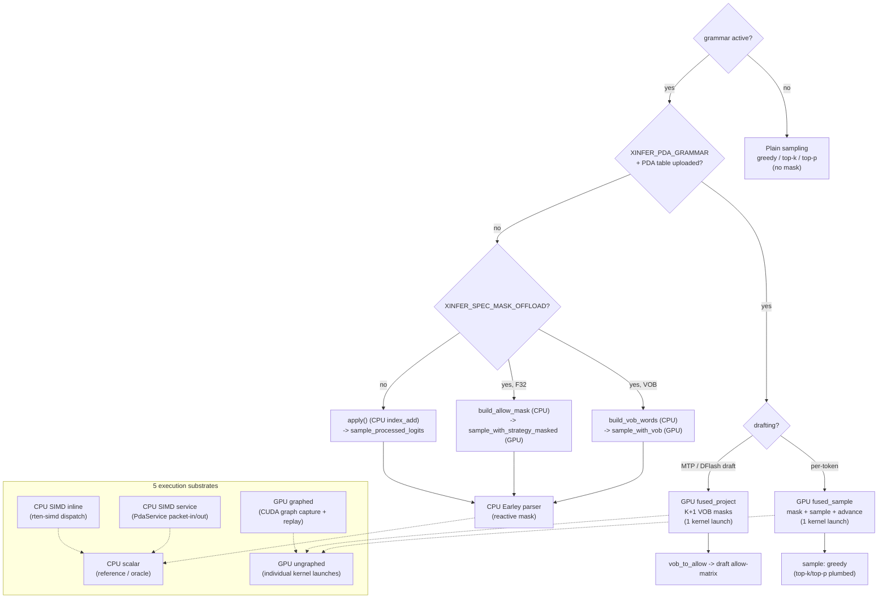

# Speculative Decoding (MTP & DFlash2)

xInfer speeds up autoregressive decode with **speculative decoding**: a small set of candidate tokens is proposed each step, then verified by the target model in a single batched forward pass. Accepted drafts advance the sequence without extra per-token decode rounds.

Two modes are supported:

| Mode | When to use | CLI |
|------|-------------|-----|
| **Built-in MTP** | Target model ships MTP prediction heads (e.g. Qwen3.5 / Qwen3.6 with MTP weights) | `--num-speculative-tokens N` |
| **DFlash2** | External DFlash2 draft model (separate safetensors checkpoint) | `--draft-model <id_or_path>` |

**Rule:** If `--draft-model` is set, xInfer uses **DFlash2** (DFlash1 checkpoints are not supported). Otherwise, `--num-speculative-tokens` enables **built-in MTP** when the target model has MTP layers.

---

## Built-in MTP

MTP (Multi-Token Prediction) uses lightweight heads bundled in the target checkpoint. Each decode step:

1. Target model produces one **anchor** token and a hidden state.
2. MTP head drafts `N` tokens autoregressively (no extra KV growth).
3. Target model verifies `[anchor, draft₀, …, draftₙ₋₁]` in one forward pass.
4. Matching prefix is accepted; GDN/Mamba state is rolled back on partial rejection (Qwen3.5 hybrid models).

### CLI

```bash
# Qwen3.5 35B with 3 speculative tokens per step
xinfer --m Qwen/Qwen3.5-35B-A3B --d 0,1 \
  --num-speculative-tokens 3 --ui-server
```

Typical values: **3–7** draft tokens. Higher values increase acceptance variance and KV verify width.

### Requirements

- Target weights must include MTP layers (`mtp.*` or GGUF `nextn.*` tensors).
- Model types with MTP support today: **Qwen3.5**, **Qwen3.5 MoE**, **Qwen3-VL** (Qwen3.5 text backbone).
- Recommended build: `./build.sh --release --features cuda,nccl,flashinfer,cutlass`

---

## DFlash2

[DFlash2](https://github.com/z-lab/dflash) uses a **separate draft model** that consumes projected intermediate hidden states from selected target layers. Draft tokens are chosen with a top-k candidate lattice (`selector_top_k` in the draft config).

### CLI

```bash
# Qwen3.8 target + DFlash2 draft (HuggingFace id or local path)
xinfer --m Qwen/Qwen3.8-... --d 0,1 \
  --draft-model <your-dflash2-draft-repo-or-path> \
  --num-speculative-tokens 7 --ui-server
```

`--draft-model` accepts either:

- A **HuggingFace model id** (downloads `config.json` + safetensors), or
- A **local directory** containing `config.json` and `model.safetensors` (or sharded index).

`--num-speculative-tokens` is the number of draft tokens proposed per step (excluding the anchor). If omitted, xInfer uses the draft model config (`block_size - 1`).

Draft weights must be **safetensors** (GGUF draft models are not supported). The checkpoint must be **DFlash2** (`architectures` contains `DFlash2` or `dflash_config.selector_top_k` is set).

### Requirements

- Target: **Qwen3.5**, **Qwen3.5 MoE**, **Qwen3-VL**, or **Qwen3.8** (dense) today.
- Draft: matching-family **DFlash2** checkpoint.
- Recommended build: `cuda,nccl,flashinfer,cutlass` (CUDA graphs optional; disable with `--disable-cuda-graph` for debugging).

---

## Python API

```python
from xinfer import Engine, EngineConfig

# Built-in MTP
cfg = EngineConfig(
    model_id="Qwen/Qwen3.5-35B-A3B",
    num_speculative_tokens=3,
)

# DFlash2 (draft_model enables DFlash2 instead of MTP)
cfg = EngineConfig(
    model_id="Qwen/Qwen3.8-...",
    draft_model="<dflash2-draft-id-or-path>",
    num_speculative_tokens=7,
)

engine = Engine(cfg, "bf16")
```

### Speculative-decoding env vars

| Var | Default | Effect |
|---|---|---|
| `XINFER_SPEC_REJECTION_SAMPLING` | off | distribution-correct verify for non-greedy targets |
| `XINFER_SPEC_ADAPTIVE_K` | off | scale K with acceptance (per-tier verify graphs, no graph/eager flip) |
| `XINFER_SPEC_ADAPTIVE_TIERS` | `[1, 3, max_k]` | adaptive-K tier/capture set (comma list, max_k always included) |
| `XINFER_SPEC_CONTEXT_WINDOW` | 4096 | DFlash context cap (0 = unbounded) |
| `XINFER_SPEC_GRAPH` | on | DFlash draft CUDA graph (0 = eager draft) |
| `XINFER_SPEC_MASK_OFFLOAD` | on (CUDA) | grammar mask in the fused CUDA sampler |
| `XINFER_SPEC_GRANULAR_MASK` | off | exact per-position FSM draft mask |
| `XINFER_VOB_SAMPLING` | off | VOB bitset grammar sampling (8x less data than F32 mask; fused bitwise-AND kernel) |
| `XINFER_PDA_GRAMMAR` | off | GPU-resident PDA grammar masking (fused mask+sample+advance; drafting projection) |

---

## Modality permutations

The grammar mask can run on five substrates, each with a different trade-off.
The diagram shows the full decision tree from "is a grammar active?" down to
the specific kernel/function that runs.



### Substrate selection

| Substrate | When used | Notes |
|---|---|---|
| **CPU scalar** | always available | the reference / oracle; correctness ground truth |
| **CPU SIMD inline** | `simd` feature, no GPU | rten-simd `load/add/store`; bit-exact vs scalar |
| **CPU SIMD service** | `PdaService` (device model) | packet-in/packet-out; emulates the GPU batch model on CPU |
| **GPU ungraphed** | `XINFER_PDA_GRAMMAR=1` | individual `fused_sample` / `fused_project` launches |
| **GPU graphed** | CUDA graph capture | the model-forward graph; PDA kernels launch individually (dynamic K) |

### Sampling-mode permutations

| Mode | PDA fused_sample | VOB sampler | CPU apply |
|---|---|---|---|
| greedy | implemented | implemented | implemented |
| top-k | plumbed (FFI param) | implemented | implemented |
| top-p | plumbed (FFI param) | implemented | implemented |

The PDA `fused_sample` kernel currently implements greedy; top-k/top-p are
plumbed through the FFI signature for a future fused implementation (the VOB
and CPU paths already support all three).

### Drafting permutations

| Drafter | PDA projection | Mask application |
|---|---|---|
| MTP (built-in) | `fused_project` (K+1 VOB) | `mask_draft_logits` on verify logits |
| DFlash (external) | `fused_project` (K+1 VOB) | `vob_to_allow` -> `draft_tokens` allow-matrix |
| none | n/a | n/a |

K is dynamic (adaptive-K), so the projection kernel is launched individually
(not captured in a CUDA graph).

See also:
- [guided_decoding.md](./guided_decoding.md) - the grammar/mask workflow
- [anti_loop_design.md](./anti_loop_design.md) - the in-flight repetition detector
- [qos_scheduling.md](./qos_scheduling.md) - the QoS scheduling interaction

---

## Flags reference

| Flag | Description |
|------|-------------|
| `--num-speculative-tokens N` | Draft tokens per decode step. Enables **MTP** when the target has MTP heads and `--draft-model` is unset. With `--draft-model`, sets DFlash2 draft width (optional; defaults from draft config). |
| `--draft-model <id_or_path>` | External **DFlash2** draft model. Enables DFlash2 and disables built-in MTP. |

**Removed:** `--mtp` (use `--num-speculative-tokens`), `--draft-model-id` / `--draft-model-path` (use `--draft-model`).

---

## Tips & limitations

- **Throughput:** Speedup depends on draft acceptance rate and model size. Monitor logs for `MTP Stats` / `DFlash2 Stats` acceptance summaries.
- **Memory:** Verify passes append up to `N+1` tokens per step; ensure KV budget via `--kv-fraction` and `--max-num-seqs`.
- **Hybrid models:** Qwen3.5 GDN layers require state rollback on rejected drafts; this is handled automatically.
- **Batching:** Speculative decode is optimized for `batch_size=1` decode steps; larger batches use a batched DFlash2 path.
- **PD disaggregation:** Do not combine speculative decode with PD client/server modes on hybrid Mamba models.

---

## Quick test

```bash
# 1. Health check
curl -s http://localhost:8000/v1/models

# 2. Short completion (MTP or DFlash2 server)
curl -s http://localhost:8000/v1/chat/completions \
  -H "Content-Type: application/json" \
  -d '{"model":"Qwen/Qwen3.5-35B-A3B","messages":[{"role":"user","content":"Hello"}],"max_tokens":64}'
```

See also [test_model.md](./test_model.md) for full model validation workflows.
